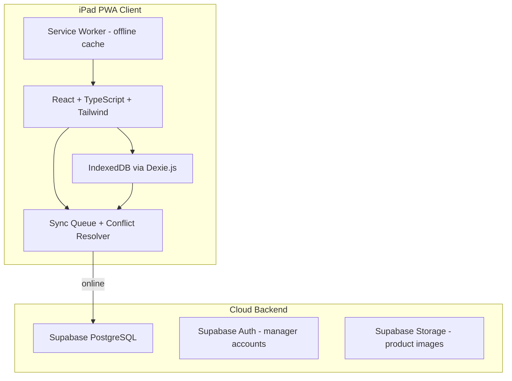
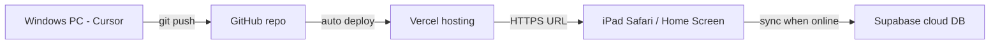
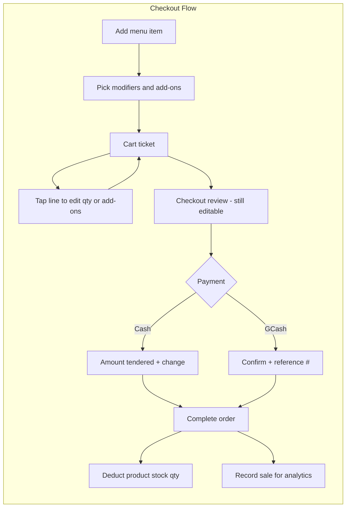
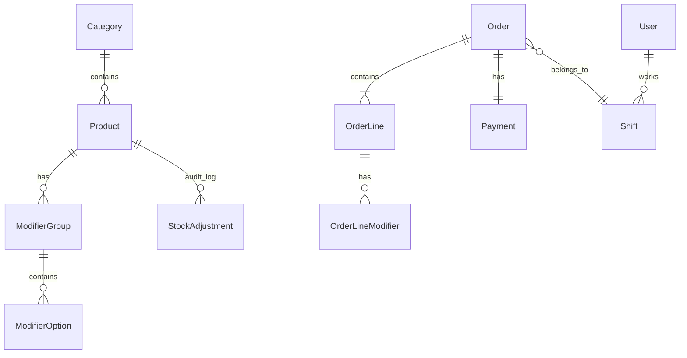

# iPad POS Terminal — Implementation Plan

## Web App Approach (No Mac Required)

**Yes — this is a web app, not a native iOS app.** You do not need a Mac, Xcode, or an Apple Developer account.


|                 | Native iOS App            | **Our Web App (PWA)**                            |
| --------------- | ------------------------- | ------------------------------------------------ |
| Build machine   | Mac required              | **Your Windows PC**                              |
| App Store       | Required for distribution | **Not needed**                                   |
| Install on iPad | Download from App Store   | **Open URL in Safari → Add to Home Screen**      |
| Offline support | Built-in                  | **Service Worker + IndexedDB**                   |
| Updates         | App Store review          | **Deploy once, all iPads get updates instantly** |


**How it works in practice:**

1. **Develop** on your Windows PC using VS Code / Cursor (React + Vite)
2. **Run locally** during dev at `http://localhost:5173` — test in any browser
3. **Deploy** to a free/cheap web host (Vercel, Netlify, or Cloudflare Pages)
4. **Use on iPad**: open the deployed URL in Safari → Share → **Add to Home Screen**
5. The icon launches **full-screen like a native app** — no browser chrome, touch-optimized

The mockup repo you linked is already static HTML web pages — we're turning that design into a fully functional web app with a real database and offline support.

---

## What We're Building

A **Progressive Web App (PWA)** — a website that behaves like an installed app on iPad. Optimized for **iPad landscape**, works **offline at the register**, and **syncs to the cloud** when Wi‑Fi is available. The UI follows your mockup repo's **Modern Bistro Heritage** design system (heritage red `#970000`, cream white `#fbf9f8`, Hanken Grotesk + Inter, 48px touch targets).

**Mockup basis** (reference only — not copied as-is): [pregos-pos/stitch_savorycart_modern_pos](https://github.com/jmcarlet1008/pregos-pos/tree/main/stitch_savorycart_modern_pos)


| Mockup Screen                        | App Module                            |
| ------------------------------------ | ------------------------------------- |
| `login_prego_s_cucina_updated`       | PIN login + roles (Cashier / Manager) |
| `register_prego_s_cucina_updated`    | Order taking + checkout               |
| `menu_editor_prego_s_cucina_updated` | Product & modifier management         |
| `inventory_prego_s_cucina_updated`   | Stock tracking + low-stock alerts     |
| `analytics_prego_s_cucina_updated`   | Sales reporting + export              |


---

## Recommended Tech Stack




| Layer    | Choice                           | Why                                                         |
| -------- | -------------------------------- | ----------------------------------------------------------- |
| Frontend | **React 19 + Vite + TypeScript** | Fast dev, component reuse across 5 screens                  |
| Styling  | **Tailwind CSS v4**              | Matches mockup token structure exactly                      |
| Local DB | **Dexie.js** (IndexedDB)         | Reliable offline POS data, queryable                        |
| Cloud    | **Supabase**                     | Postgres + realtime + row-level security + file storage     |
| Routing  | **React Router v7**              | Sidebar nav between Register / Inventory / Menu / Analytics |
| Charts   | **Recharts**                     | Hourly sales + top items (Analytics mockup)                 |
| PWA      | **vite-plugin-pwa**              | Install on iPad, cache shell + assets offline               |


**New project location:** `C:\Users\ADMIN\Projects\pregos-pos` (git init, clone mockup design tokens into `docs/design/`)

**Deployment target:** Vercel (recommended — free tier, auto-deploy from GitHub, HTTPS required for PWA)




---

## Architecture Overview




**Pricing rule:** All menu prices are **VAT-inclusive** (12% already baked in). The ticket shows **line totals and a single Amount Due** — no separate VAT line or VAT math at checkout.

**Inventory rule:** Stock lives **directly on each Product** (`stock_on_hand`). When an order completes, deduct `order_line.quantity` from that product's stock automatically. Block or warn checkout if stock is insufficient (manager override optional).

**Offline-first rule:** All reads/writes go to **local IndexedDB first**. A background sync worker pushes pending mutations to Supabase when `navigator.onLine` is true. Conflicts resolve with **last-write-wins per entity** + an audit log for orders (never silently drop a sale).

---

## Data Model (Core Entities)




Key fields:

- **Product**: name, category, price (₱, **VAT-inclusive**), description, image, active, sort order, `**stock_on_hand`**, `**par_level**`, `**reorder_point**`, `**track_inventory**` (bool), unit (e.g. pcs, lbs)
- **ModifierGroup**: name, required, min/max picks (e.g. "Add-ons — pick any")
- **ModifierOption**: name, **price_adjustment** (₱, VAT-inclusive add-on cost), optional `**deducts_stock`** + qty (for add-ons that consume inventory, e.g. extra cheese)
- **Order**: order_number, status (active/completed/voided), **total** (sum of lines, no separate VAT), shift_id
- **OrderLine**: product_id, quantity, unit_price, **line_total** (= (product price + sum of selected modifier adjustments) × qty)
- **OrderLineModifier**: modifier_option_id, name snapshot, price_adjustment snapshot
- **Payment**: method (`cash` | `gcash`), amount_tendered, change, gcash_reference (nullable), status (`pending` | `confirmed`)
- **StockAdjustment**: product_id, delta (+/-), reason (sale / manual / void), order_id (nullable), created_by

**VAT handling:** Prices displayed and charged are final. For reporting only (Analytics), optionally compute VAT portion using `total × 12/112` — never shown to cashier at checkout.

**Stock deduction on order complete:**

```
for each order_line:
  if product.track_inventory:
    product.stock_on_hand -= order_line.quantity
    log StockAdjustment(reason: "sale", delta: -qty)
  for each add-on modifier where deducts_stock:
    deduct modifier stock qty × order_line.quantity
```

Every record gets `id`, `created_at`, `updated_at`, `sync_status` (`pending` | `synced` | `conflict`).

---

## UI Structure (from mockups)

Shared **AppShell** across all screens:

- Left sidebar: Register, Inventory, Menu Editor, Analytics (+ Settings, Support)
- Top bar: station name, Wi‑Fi/sync status, clock, logged-in user
- iPad landscape layout: **product grid (left) + order ticket panel (right, ~360px)** on Register screen

Design tokens ported from `[DESIGN.md](https://github.com/jmcarlet1008/pregos-pos/blob/main/stitch_savorycart_modern_pos/modern_bistro_heritage/DESIGN.md)` into `tailwind.config.ts`:

- Primary red `#970000`, background `#fbf9f8`, 48px min touch targets
- Minimal elevation (1px borders, no heavy shadows)
- Optional checkerboard accent divider for brand headers

---

## Feature Modules (Phased Delivery)

### Phase 1 — Foundation (Week 1)

- Scaffold Vite + React + TS + Tailwind + PWA manifest
- Port design tokens + shared components: `Button`, `Card`, `Input`, `Sidebar`, `TopBar`, `PinPad`, `Modal`
- AppShell routing + iPad viewport meta (`viewport-fit=cover`, `apple-mobile-web-app-capable`)
- Dexie schema + seed data (sample menu from mockups: Pizza, Pasta, etc.)

### Phase 2 — Auth + Register (Week 1–2)

**Login screen** (from mockup):

- 4-digit PIN keypad with haptic feedback
- Roles: Cashier (Register only) vs Manager (all modules)
- Clock In / Switch User / Manager Login

**Register screen** (core POS):

- Category tabs filter product grid
- Tap product → **modifier/add-on picker modal** (required groups enforced before adding to cart)
- Tap line item in ticket → **edit panel**: change qty, add/remove add-ons, delete line
- Line display shows base price + each add-on with its price (e.g. "Margherita + Extra Cheese ₱2.00")
- Order ticket: **Total only** (VAT-inclusive — no subtotal/VAT breakdown shown)
- Show low-stock badge on product tiles when `stock_on_hand ≤ reorder_point`
- Block add-to-cart or warn when out of stock (configurable)
- Active session with order number auto-increment
- Hold/resume orders (optional but useful for busy shifts)

**Checkout screen** (before payment):

- Full order review — **still editable**: tap any line to modify add-ons or qty
- "Add item" shortcut to return to menu without losing cart
- Amount Due = sum of all line totals (VAT already included)
- Then proceed to Cash or GCash payment

### Phase 3 — Payments (Week 2)

**Cash** (from mockup):

- Quick tender buttons: ₱50, ₱100, ₱500, ₱1000
- Custom amount entry + live change calculation
- Complete checkout → print-ready receipt view (browser print)

**GCash — manual first, API-ready later:**

- Checkout flow: select GCash → show exact amount due + optional static merchant QR image
- Staff enters GCash reference number (optional field) → "Confirm Payment"
- Payment record stored with `method: gcash`, `status: confirmed`, `gcash_reference`
- Abstract `PaymentProvider` interface so GCash Pay API / PayMongo can plug in later without rewriting checkout UI

```typescript
// Future-ready payment abstraction
interface PaymentProvider {
  initiate(amount: number): Promise<PaymentSession>;
  verify(sessionId: string): Promise<PaymentResult>;
}
// Phase 3: ManualGCashProvider
// Phase 7: GCashAPIProvider (stub)
```

### Phase 4 — Menu Editor (Week 2–3)

From mockup:

- Category-filtered product list with search
- Create/edit item: photo upload, name, category, **VAT-inclusive price**, description
- **Inventory fields on product**: track_inventory toggle, stock_on_hand, par_level, reorder_point, unit
- Modifier groups: add group, options, required/pick-N rules, **price_adjustment per add-on**
- Drag-to-reorder categories and products
- Changes sync to Register product grid immediately (local first)

### Phase 5 — Inventory (Week 3)

Product-centric inventory (no separate inventory SKUs in v1):

- Inventory list = **all products where `track_inventory = true`**
- Each row shows product name, on-hand vs par level progress bar
- Low-stock badge (red alert when `stock_on_hand ≤ reorder_point`)
- Detail panel: current stock, par/reorder levels, recent StockAdjustment audit log
- Manual stock adjustment (+/- count) with reason (delivery, waste, correction)
- **Auto-deduct on sale**: completing an order reduces `product.stock_on_hand` by line qty
- Void/refund order → **restores stock** automatically

### Phase 6 — Analytics + Reporting (Week 3–4)

From mockup:

- KPI cards: Gross Sales, Total Orders, Avg Ticket Size (with % vs yesterday)
- Hourly sales bar chart (Today / Week toggle)
- Top menu items ranked list
- Filters: date range, payment method (Cash vs GCash split)
- Export: CSV download (QuickBooks export can come later; CSV is Phase 6 scope)

### Phase 7 — Cloud Sync (Week 4)

- Supabase project setup: tables mirror Dexie schema
- Sync engine: on app load + every 30s when online + on `online` event
- Push pending local changes; pull remote changes since `last_synced_at`
- Sync indicator in top bar (mockup Wi‑Fi icon area): "Synced" / "Offline — N pending"
- Manager backup/restore via cloud

### Phase 8 — Deploy + iPad UX (ongoing)

- Deploy to Vercel; connect custom domain if desired (e.g. `pos.pregoscucina.com`)
- PWA manifest + icons so "Add to Home Screen" shows your logo
- In-app setup guide: "Open Safari → Share → Add to Home Screen"
- Prevent accidental navigation (confirm before leaving active order)
- Large touch targets, no hover-only interactions
- Keyboard-less number entry everywhere (PIN, cash tender, stock counts)
- Sound/haptic feedback on key actions (`navigator.vibrate` where supported)

---

## Key Files to Create

```
pregos-pos/
├── docs/design/DESIGN.md          # copied from mockup repo
├── public/manifest.json           # PWA install config
├── src/
│   ├── db/
│   │   ├── schema.ts              # Dexie tables
│   │   └── seed.ts                # sample menu data
│   ├── sync/
│   │   ├── syncEngine.ts          # offline ↔ Supabase
│   │   └── conflictResolver.ts
│   ├── features/
│   │   ├── auth/                  # PIN login, roles
│   │   ├── register/              # cart, checkout
│   │   ├── payments/              # cash + gcash providers
│   │   ├── menu/                  # product CRUD
│   │   ├── inventory/             # stock management
│   │   └── analytics/             # reports + charts
│   ├── components/ui/             # shared design system
│   └── App.tsx                    # shell + routing
├── supabase/migrations/           # cloud schema
└── tailwind.config.ts             # heritage red/white tokens
```

---

## GCash Future Integration (designed now, built later)

When you're ready for API integration:

1. Register GCash for Business / PayMongo merchant account
2. Implement `GCashAPIProvider` behind existing `PaymentProvider` interface
3. Checkout shows dynamic QR from API; webhook confirms payment automatically
4. No changes needed to order/inventory/analytics modules

---

## Testing Checklist (iPad Safari)

- [ ] Install as PWA from Safari → launches full-screen
- [ ] Complete a Cash sale offline → data persists after refresh
- [ ] Complete a GCash sale with reference # → appears in analytics
- [ ] Edit menu item → reflects on Register immediately
- [ ] Add product with add-ons → line total reflects modifier prices (VAT-inclusive)
- [ ] Edit add-ons at checkout review → total updates before payment
- [ ] Complete order → product stock deducts by qty sold
- [ ] Void order → stock restores
- [ ] Out-of-stock product shows warning and blocks add (or manager override)
- [ ] Ticket shows Total only — no VAT line item
- [ ] Go offline mid-shift → sync catches up when online
- [ ] Manager PIN unlocks Menu Editor + Inventory; Cashier PIN does not

---

## Out of Scope (v1)

- **Native iOS/Android app** (App Store / Play Store) — web app covers iPad use case
- Mac / Xcode development
- Physical receipt printer / cash drawer hardware
- QuickBooks direct API export (CSV only in v1)
- Multi-location / multi-store
- Kitchen display system (KDS)
- GCash API live integration (Phase 7+ follow-up)

---

## Success Criteria

A cashier can: clock in with PIN → take orders with **add-ons/modifiers** (editable until payment) → see a **single VAT-inclusive total** → accept Cash or GCash → complete sale → **product stock auto-deducts** → see updated inventory and daily sales — **even during a Wi‑Fi outage**, with data syncing automatically when connection returns.
